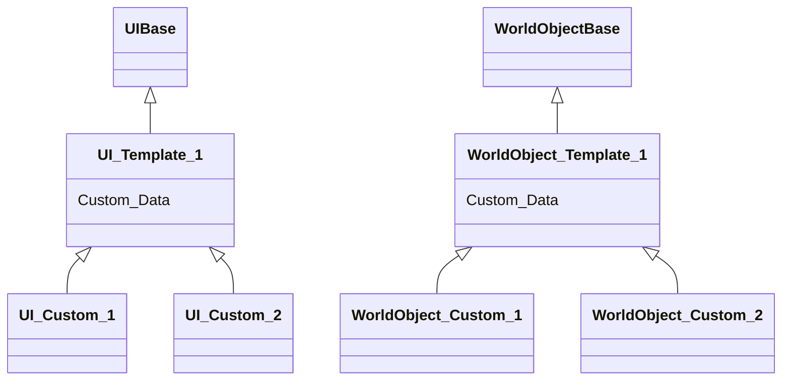

# GameFramework
 
基于PuerTS的游戏框架，欢迎学习和提交！

## 编程语言
C#, TypeScript

## 运行环境
Unity 2020.3.34f1c2, .Net Framework, Node.js

## 快速开始

- 菜单栏 Puerts/Generate Code
- 菜单栏 xasset/Build Bundles
- ``cd TypeScript``
- ``npm/cnpm install``
- ``npm run watch-build``
- Run Play

# Todo
## 悲猫3设计构想

