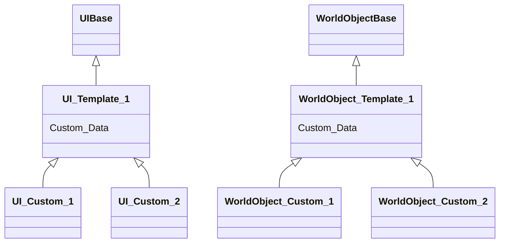

# 关于这款游戏
 
2022 CiGA Game Jam 作品

适合双人游玩的益智对抗游戏，你永远不知道下一个宝箱点出来是什么，击败对方获取胜利

[Bilibili 地址](https://www.bilibili.com/video/BV1dT411g7uu?spm_id_from=333.999.0.0&vd_source=e68c95a115d28d52befc8ea1da98dba7)

[CiGA Game Jam 地址](https://gmhub.com/game/1246)

## 编程语言
C#, TypeScript

## 运行环境
Unity 2020.3.34f1c2, .Net Framework, Node.js

## 快速开始

- 菜单栏 Puerts/Generate Code
- 菜单栏 xasset/Build Bundles
- ``cd TypeScript``
- ``npm/cnpm install``
- ``npm run watch-build``
- Run Play

## 架构设计图

